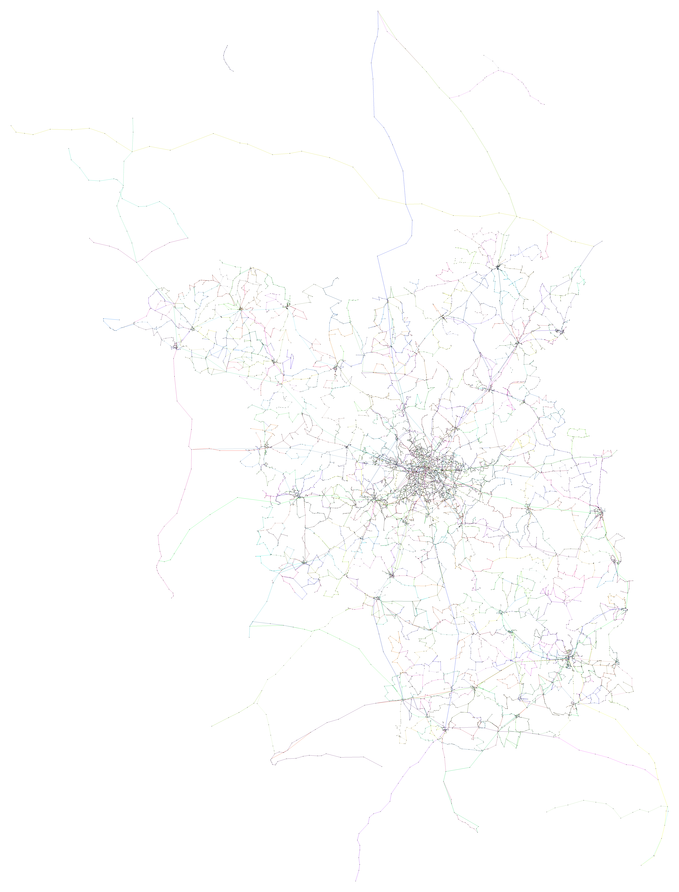
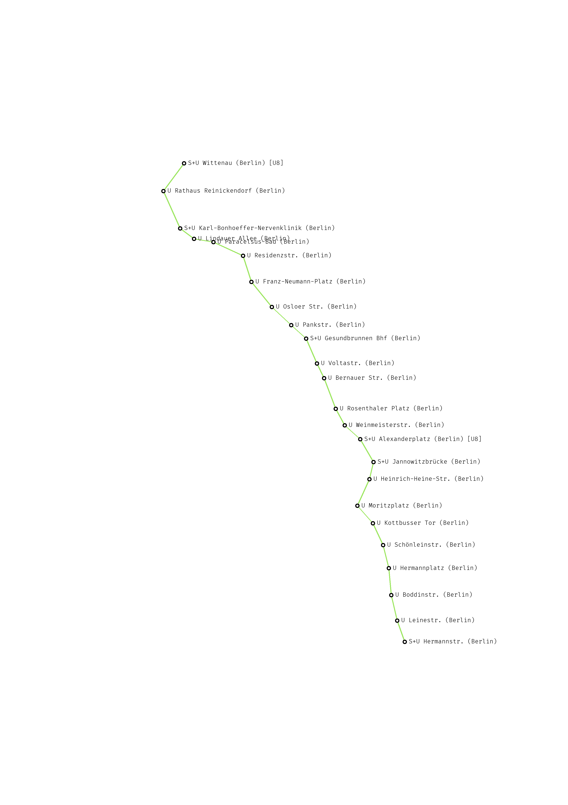

# Traffic Map

Input: Set of points with polar coordinates.

| Type         | Brand   | Line         | Stop       | Latitude | Longitude |
| ------------ | ------- | ------------ | ---------- | -------- | --------- |
| Aircraft     | Easyjet | VIE-TXL      | VIE        | 48       | 16        |
| Regional Bus | BVG     | 200          | Tiergarten | 52.50973 | 13.36319  |
| Train        | OEBB    | RJ Wien-Graz | Kapfenberg | 47.44523 | 15.29264  |

Outputs: Some maps! Ideas follow.

- Very naturalistic (like Google Maps satellite view)
- Different flavors of schematic maps (the kind you see in train/bus stations)

## Resources

- [Drawing and Labeling High-Quality Metro Maps
by Mixed-Integer Programming](http://www1.pub.informatik.uni-wuerzburg.de/pub/wolff/pub/nw-dlhqm-10.pdf), a paper where the authors create schematic traffic maps by turning map properties into numeric optimization problems - very nice!
- https://github.com/public-transport/generating-transit-maps

## Examples so far

**All of VBB**

**S-Bahn Berlin**

**BVG U8 line**

## TODO

- VBB data: Different routes that have same short name leads to funky colors
- Text rendering
- 45 degree lines
- Geographic features like rivers, lakes
- Compaction, ie render U8 line into a 3:1 ratio box
